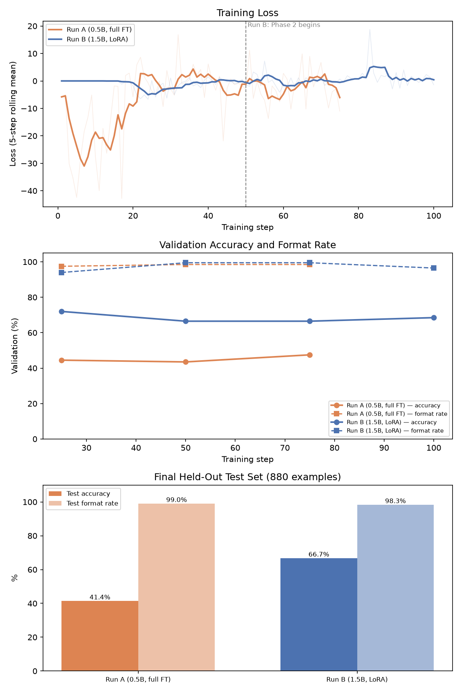

# FinetuneMathReasoning

A from-scratch Dr. GRPO (Group Relative Policy Optimization, length/std-normalization dropped) fine-tuning framework for math reasoning on GSM8K. It answers one question: under a matched sparse, correctness-only reward, does a larger model with LoRA beat a smaller model with full fine-tuning?

- **Run A**: Qwen2.5-0.5B-Instruct, full fine-tune
- **Run B**: Qwen2.5-1.5B-Instruct, LoRA (rank 16)

Both trained from scratch with a GRPO trainer, reward functions, and evaluation harness implemented in this repo — no TRL, no open-r1.

---

## Results

Evaluated on the full 880-example held-out test split (never touched during training), greedy decoding.

| Model | Test accuracy | Test format rate |
|---|---|---|
| Qwen2.5-0.5B-Instruct, untrained | close to zero (0.11%) | close to zero (0.11%) |
| Qwen2.5-1.5B-Instruct, untrained | zero (0.0%) | zero (0.0%) |
| **Run A** — 0.5B, full FT | **41.36%** | **98.98%** |
| **Run B** — 1.5B, LoRA | **66.70%** | **98.30%** |

Both base models score close to zero with the one-shot prompt this project uses — under greedy decoding they essentially never produce the required `<reasoning>/<answer>` structure. Every point of Run A's and Run B's accuracy is attributable to RL training, not latent zero-shot capability.

**Conclusion**: the hypothesis holds. Run B (1.5B, LoRA) clearly outperforms Run A (0.5B, full fine-tune), despite training roughly 1.2% of the parameters full fine-tuning touches. The gap was not free, though — Run B only reached this result via a two-phase training protocol (below); a naive single-phase run failed outright (0% accuracy) in three separate attempts before that fix worked. Run A, by contrast, succeeded under simple, default settings on every attempt.

Trained checkpoints:
- Run A (0.5B, full FT): https://huggingface.co/niksixus/qwen2.5-0.5b-gsm8k-drgrpo
- Run B (1.5B, LoRA): https://huggingface.co/niksixus/qwen2.5-1.5b-gsm8k-drgrpo-lora



### Findings: the two mitigations don't transfer between the two arms

Both `outlier_clip` (caps each sample's raw `advantage * sum_log_prob` loss term) and the KL penalty against a frozen reference adapter exist to stabilize Run B's LoRA training — and neither generalizes to Run A:

- **Outlier-clip helps Run B, hurts Run A.** Applied to the full-FT arm by default, it caused genuine back-half degradation: format compliance dropped, completion length crept up, and 20-50% of the batch was being clamped every step — not "rare outlier protection" at that rate, more like routine, distorting intervention. Disabling it for Run A (`--outlier_clip 0`) removed the degradation and is what produced the 41.36%/98.98% result above, versus 33.75%/79.43% with it left on.
- **KL is essential for Run B, unused by Run A.** Every attempt to train Run B without a properly-configured KL reference failed completely — not "worse," but a total failure to ever discover the required output format (0% accuracy, three separate times). Run A never needed a KL term at all: full fine-tuning never showed the instability KL exists to solve, so it isn't part of Run A's training command anywhere.

Because Run A's ablation (with/without outlier-clip) has a comparable working alternative on both sides, while Run B's KL ablation is a binary success-or-total-failure, these two findings aren't presented as a symmetric side-by-side comparison — Run A's config above already reflects the better setting directly.

### Finding: Run B needs a two-phase bootstrap, not a single continuous run

Dr. GRPO with LoRA repeatedly failed to discover the `<reasoning>/<answer>` format at all when any KL penalty, length penalty, or outlier-clip was active from step 1 — even at near-zero strength. The fix that worked:

1. **Phase 1**: run genuinely unrestricted (`--outlier_clip 0`, `--overlong_penalty_scale 0`, `--kl_coef 0`) until the format is reliably learned (~step 25-50).
2. **Phase 2**: resume from that checkpoint, turn all mitigations on at full strength immediately, and use the Phase 1 checkpoint's own adapter — loaded as a second, frozen adapter on the same base model — as the KL reference. This makes the KL term mean "don't drift from a checkpoint that already knows the format," rather than "don't drift from the untrained base," which is incoherent for a model that hasn't learned the task yet.

This is what `--kl_reference_path` implements (see Training below).

---

## Features

- **Sparse, verifiable reward**: `format_reward` (structural `<reasoning>/<answer>` check) and `accuracy_reward` (numeric-equivalence check against GSM8K's ground truth) — `src/rewards.py`.
- **Dr. GRPO trainer, implemented from scratch**: group sampling, mean-centered advantage (no `/std`, no length normalization), completion-only masking, soft overlong-length penalty, per-sample loss outlier clipping, and an optional KL penalty against either the adapter-disabled base model or a second, frozen adapter checkpoint — `src/grpo.py`.
- **Data pipeline**: pools GSM8K's train+test splits into a fresh 80/10/10 split, subsamples a fixed training pool, and builds chat-templated prompts — `src/data.py`.
- **CLI-driven training**: one script, both model/adaptation configs, run-scoped checkpoints and logs, resumable.
- **Full held-out test-set evaluation** (`evaluate.py`) and a small-sample interactive inspection tool (`test.py`).
- **No-framework sanity-check suite**: validates every highest-risk mechanic (group alignment, mask boundaries, sampling-not-greedy, PEFT optimizer scope, frozen KL reference adapter) on CPU before any real GPU run.
- **Result extraction and plotting** (`scripts/extract_results.py`, `scripts/plot_results.py`): turns raw training logs and evaluation JSON into the CSVs and figures in `results/`.

---

## Installation

This project is managed with [`uv`](https://docs.astral.sh/uv/); `pyproject.toml`/`uv.lock` are the source of truth for the exact, tested environment (including a specific CUDA 12.8 PyTorch build).

```bash
git clone https://github.com/Nikhil-iitg27/FinetuneMathReasoning.git
cd FinetuneMathReasoning
uv sync
```

---

## Directory Structure

```
FinetuneMathReasoning/
│
├── src/
│   ├── data.py         # GSM8K pooling/splitting, prompt-only dataset
│   ├── grpo.py         # GRPOConfig and GRPOTrainer (Dr. GRPO)
│   └── rewards.py      # format_reward, accuracy_reward
│
├── scripts/
│   ├── sanity_checks/       # standalone, no-pytest validation scripts (run_all.py)
│   ├── extract_results.py   # raw logs + eval JSON -> results/*.csv
│   └── plot_results.py      # results/*.csv -> results/*.png
│
├── results/             # extracted metrics, final eval numbers, and plots
├── train.py             # CLI-driven training script
├── evaluate.py          # full held-out test-set evaluation
├── test.py              # small-sample evaluation + interactive inference
└── pyproject.toml / uv.lock
```

`checkpoints/`, `logs/`, and `data/` are produced at runtime and are gitignored.

---

## Usage

### 0. Sanity checks (run before any real training)

```bash
uv run scripts/sanity_checks/run_all.py
```

Must report all-PASS before launching a real run.

### 1. Training

```bash
# Run A: 0.5B, full fine-tune. outlier-clip disabled per the finding above.
uv run train.py --model_name Qwen/Qwen2.5-0.5B-Instruct --run_name run_a \
  --adaptation full --learning_rate 1e-5 --max_grad_norm 1.0 --outlier_clip 0 \
  --num_steps 75 --grad_checkpointing

# Run B, Phase 1: 1.5B, LoRA, fully unrestricted bootstrap.
uv run train.py --model_name Qwen/Qwen2.5-1.5B-Instruct --run_name run_b \
  --adaptation lora --learning_rate 1e-4 --max_grad_norm 0.5 \
  --overlong_penalty_scale 0 --outlier_clip 0 --kl_coef 0 \
  --num_steps 50 --grad_checkpointing

# Run B, Phase 2: resume from Phase 1, protections at full strength,
# Phase 1's own checkpoint as the frozen KL reference.
uv run train.py --model_name Qwen/Qwen2.5-1.5B-Instruct --run_name run_b \
  --adaptation lora --learning_rate 1e-4 --max_grad_norm 0.5 \
  --overlong_penalty_scale 1.0 --outlier_clip 100.0 --kl_coef 0.05 \
  --kl_reference_path checkpoints/run_b/step_50 \
  --resume_from checkpoints/run_b/step_50 --num_steps 100 --grad_checkpointing
```

Key flags: `--outlier_clip` (a value `<= 0` disables clipping entirely), `--overlong_penalty_scale`/`--overlong_cache` (soft length penalty), `--kl_coef` (requires `--adaptation lora`), `--kl_reference_path` (loads a checkpoint's adapter as a second, frozen reference adapter for the KL term — also requires LoRA). See `uv run train.py --help` for the full list.

- Checkpoints: `checkpoints/{run_name}/step_{N}/` and `checkpoints/{run_name}/final/`, each with a `run_config.json` snapshot.
- Logs: `logs/{run_name}.log` (human-readable) and `logs/{run_name}_metrics.jsonl` (structured, per-step and per-validation).

### 2. Evaluation

```bash
# Full held-out test-set evaluation (880 examples, greedy) - this produced every
# number in the Results table above.
uv run evaluate.py --model_name Qwen/Qwen2.5-0.5B-Instruct \
  --checkpoint_dir checkpoints/run_a/final --adaptation full --run_name run_a

# Small-sample inspection + interactive REPL.
uv run test.py --model_name Qwen/Qwen2.5-1.5B-Instruct \
  --checkpoint_dir checkpoints/run_b/final --adaptation lora
```

### 3. Extracting results and plots

```bash
uv run scripts/extract_results.py   # logs/*.jsonl, logs/*_test_eval.json -> results/*.csv
uv run scripts/plot_results.py      # results/*.csv -> results/*.png
```

---

## Reward Functions

Implemented in `src/rewards.py`:
- **`format_reward`**: 1.0 if the completion is exactly one `<reasoning>...</reasoning>` followed by one `<answer>...</answer>`, nothing else outside the tags; else 0.0.
- **`accuracy_reward`**: 1.0 if the extracted `<answer>` is numerically equal (tolerance `1e-4`, after stripping currency/commas/units) to the ground truth; else 0.0.

---

## Data

- GSM8K's train+test splits are pooled (~8,792 problems) and re-split 80/10/10 — train ~7,033 / val ~879 / test 880 — cached to `data/splits/seed{N}.json` so repeated runs see identical splits (this cache is a convenience only; the split is fully deterministic from the seed and is not needed to reproduce it).
- A fixed subsample of the training partition (default 1,500 prompts) is used per run, since Dr. GRPO's signal comes from `group_size` rollouts per prompt, not from covering every problem.
- Prompts are built via `tokenizer.apply_chat_template(...)` with a one-shot worked example, since Qwen2.5-Instruct expects chat-template framing to reliably follow the requested output format.
- The held-out test split (880 examples) is touched only by `evaluate.py`, never during training or the periodic validation checks in `train.py`.

---

## Acknowledgements

- [GSM8K Dataset](https://huggingface.co/datasets/gsm8k)
- [Qwen2.5 Models](https://huggingface.co/Qwen)
- [Hugging Face Transformers](https://github.com/huggingface/transformers) / [PEFT](https://github.com/huggingface/peft)
